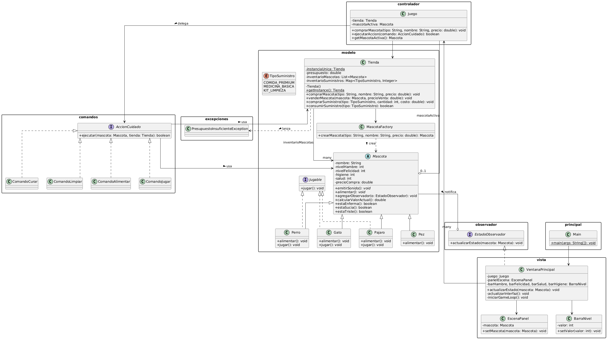
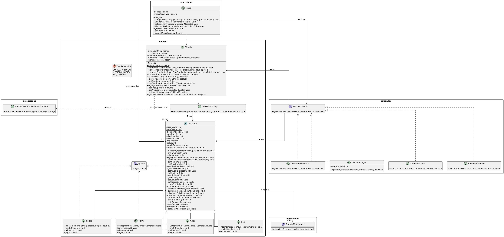
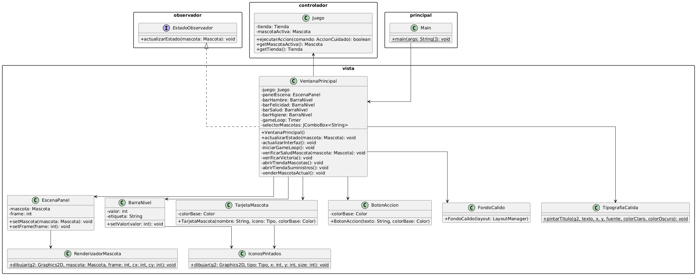

# Simulador de Tienda de Mascotas

**Integrantes Grupo 17:**

* Diego Ignacio Mellado Torres 
* Cristobal Camilo Araya Lillo 
* Matias Santiago Palacios Urra 

## Diagrama UML

### Diagrama de Clases General

### Diagrama de Clases: Modelo y Patrones de Diseño

### Diagrama de Clases: Vista

## Interfaz Gráfica

## [cite_start]Patrones de Diseño Proyecto [cite: 1]

[cite_start]Durante el Proyecto se aplicaron cuatro patrones de diseño fundamentales para asegurar alta cohesión, bajo acoplamiento y escalabilidad. [cite: 2]

### [cite_start]A. Patrones Creacionales [cite: 3]

[cite_start]**Singleton (Clase Tienda):** [cite: 4]
* [cite_start]**Propósito:** Garantizar que exista una única instancia del inventario y presupuesto compartida en toda la aplicación, proporcionando un punto de acceso global. [cite: 5]
* [cite_start]**Implementación:** Se privatizó el constructor de Tienda y se expuso el método estático getInstance(). [cite: 6] [cite_start]Esto evita que diferentes partes del código (como el Controlador o los Comandos) creen múltiples tiendas con presupuestos desincronizados. [cite: 7]

[cite_start]**Factory Method (Clase MascotaFactory):** [cite: 8]
* [cite_start]**Propósito:** Proporcionar una interfaz para crear objetos en una superclase, permitiendo que las subclases alteren el tipo de objetos que se crearán. [cite: 9]
* **Implementación:** Se utiliza al momento de adoptar. [cite_start]La Tienda no necesita saber si está instanciando un Perro o un Gato; [cite: 10] [cite_start]simplemente le pasa el tipo como un String a la fábrica y esta retorna la instancia polimórfica correcta, centralizando la lógica de creación. [cite: 11]

### [cite_start]B. Patrones de Comportamiento [cite: 12]

[cite_start]**Observer (Interfaz EstadoObservador):** [cite: 13]
* [cite_start]**Propósito:** Definir un mecanismo de suscripción para notificar a múltiples objetos sobre cualquier evento que le suceda al objeto que están observando. [cite: 14]
* [cite_start]**Implementación:** Ventana Principal implementa esta interfaz y se "suscribe" a la Mascota activa. [cite: 15] [cite_start]Así, cuando el GameLoop desgasta el hambre o la felicidad, la mascota notifica automáticamente a la vista para que se repinte. [cite: 16] [cite_start]Esto eliminó la necesidad de forzar el refresco de la Ul manualmente desde el Controlador, logrando un desacoplamiento total entre el Modelo y la Vista. [cite: 17]

[cite_start]**Commando (Interfaz Accion Cuidado y sus implementaciones):** [cite: 18]
* [cite_start]**Propósito:** Convertir una solicitud en un objeto independiente que contiene toda la información sobre la solicitud. [cite: 19]
* [cite_start]**Implementación:** Los botones de acción (Alimentar, Jugar, Curar, Limpiar) ya no ejecutan lógica condicional dentro del Controlador Juego. [cite: 20] [cite_start]En su lugar, instancian comandos (ComandoAlimentar, etc.) que encapsulan el costo monetario, el consumo de suministro y el efecto sobre la mascota. [cite: 21] [cite_start]Si a futuro se requiere añadir una acción como "Pasear", solo se crea una nueva clase Comando sin tocar la arquitectura existente. [cite: 22]

## Decisiones Importantes y Mejoras

Esta sección detalla las decisiones importantes que el equipo tomó a lo largo del proyecto, destacando especialmente los cambios aportados a la temática central. Más allá de la planificación inicial de los patrones de diseño y la arquitectura reflejada en el diagrama UML, el equipo demostró un gran nivel de adaptación al tomar decisiones críticas durante la codificación. 

Entre las decisiones más destacadas, priorizamos la adaptación y mejora del apartado gráfico para ofrecer una interfaz mucho más amena y agradable a la vista. Asimismo, supimos priorizar el alcance del proyecto dejando de lado características planificadas, como la "compra de hábitats", al concluir que no aportarían un valor verdaderamente significativo a la experiencia. Consideramos que la fluida comunicación de estas decisiones internas fue fundamental para consolidar el proyecto y presentar un mejor trabajo hoy.

## Problemas Identificados y Autocrítica

A continuación, exponemos los problemas identificados durante el desarrollo y una autocrítica sobre nuestra gestión. A pesar de los logros alcanzados, somos conscientes de que existen múltiples aspectos a mejorar, particularmente en la calidad general del código. 

Durante el proceso, enfrentamos dificultades técnicas al intentar unir distintas partes de la lógica del programa. Esto derivó ocasionalmente en la creación de funciones sin un propósito claro (código muerto) y nos forzó a tener que reescribir clases enteras para lograr la cohesión necesaria. Finalmente, a nivel de diseño de la experiencia, reconocemos que debemos investigar y aplicar mejores mecánicas de jugabilidad, ya que actualmente la experiencia se siente un poco monótona. Ya por ultimo nos hubiera gustado aprovechar la ayuda propuesta por nuestra supervisora que por carga externa no pudo ser así.
